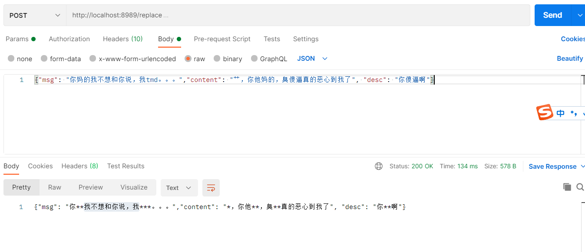

# AC自动机敏感词拦截
根据敏感词汇，构建AC自动机。高效的实时屏蔽敏感词汇。
## 目录结构

```
- cmd: 程序入口
- config: 配置文件
    - config.txt: 敏感词
- internal: 内部模块
    - apiserver: API模块，功能简单，不细分模块
    - pkg: 内部模块
        - ac: ac自动机
- pkg: 通用模块
    - fs: 文件操作
    - log: 日志模块
```
## 使用说明
可以做代理服务，当Json数据传入，进行敏感词拦截实时传出。<hr>
http://localhost:8989/replace



用插入和删除操作来维护当前的AC自动机。插入任意的目标String。<br>
删除操作只能删除config.txt中的String。Trie树中的节点可能需复用，所以不一定都能删除成功。

http://localhost:8989/insert <br>
http://localhost:8989/delete <br>


